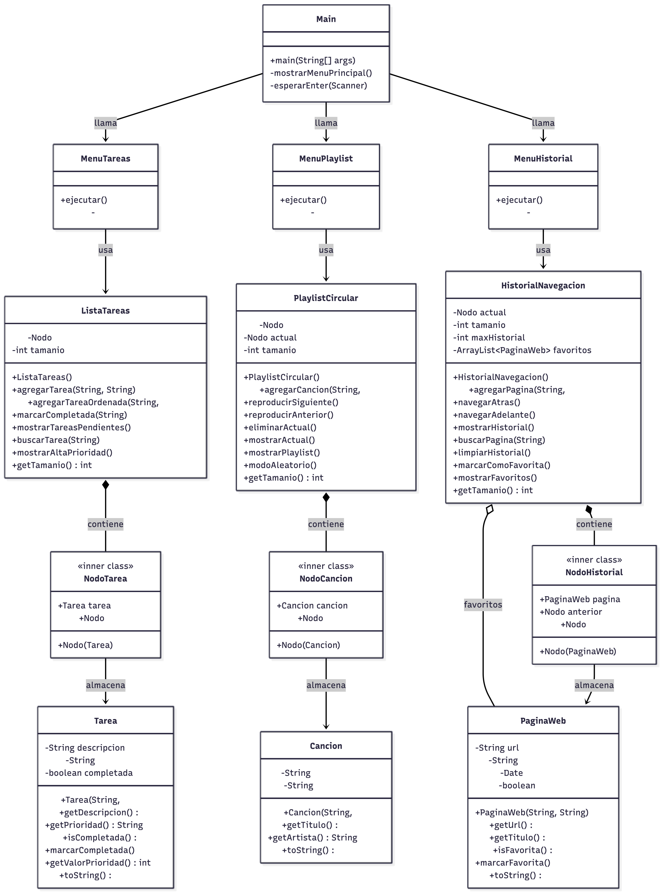

# Informe: Ejercicios de Estructuras de Datos - Listas

**Asignatura:** Estructura de Datos  
**Tema:** Listas Enlazadas (Simple, Circular y Doblemente Enlazada)  
**Fecha:** Octubre 2025

---

## Índice

1. Introducción
2. Ejercicio 1: Lista de Tareas Pendientes
3. Ejercicio 2: Playlist Musical Circular
4. Ejercicio 3: Historial de Navegación Web
5. Diagrama de Clases
6. Conclusiones
7. Repositorio

---

## 1. Introducción

Este informe documenta la implementación de tres ejercicios sobre estructuras de datos dinámicas, específicamente listas enlazadas. Cada ejercicio utiliza un tipo diferente de lista para resolver problemas del mundo real:

- **Lista Simple**: Para gestión de tareas con prioridades
- **Lista Circular**: Para una playlist musical que reproduce en bucle
- **Lista Doblemente Enlazada**: Para historial de navegación con movimiento bidireccional

---

## 2. Ejercicio 1: Lista de Tareas Pendientes

### 2.1 Descripción del Problema

Desarrollar una aplicación para gestionar tareas pendientes donde cada tarea tiene una descripción y una prioridad (alta, media, baja).

### 2.2 Estructura de Datos Utilizada

**Lista Enlazada Simple**

Una lista enlazada simple donde cada nodo contiene:
- Un objeto `Tarea` (descripción, prioridad, estado)
- Un puntero al siguiente nodo

```
[Tarea1] -> [Tarea2] -> [Tarea3] -> null
```

### 2.3 Implementación

#### Clase Tarea
```java
public class Tarea {
    private String descripcion;
    private String prioridad;  // "alta", "media", "baja"
    private boolean completada;
}
```

**Atributos:**
- `descripcion`: Texto descriptivo de la tarea
- `prioridad`: Nivel de importancia (alta=3, media=2, baja=1)
- `completada`: Estado de la tarea

**Métodos clave:**
- `getValorPrioridad()`: Convierte la prioridad a valor numérico para ordenamiento

#### Clase ListaTareas

Implementa una lista enlazada simple con un nodo interno.

**Operaciones implementadas:**
1. **Agregar tarea**: O(n) - Inserta al final
2. **Agregar tarea ordenada** (RETO): O(n) - Inserta manteniendo orden por prioridad
3. **Marcar completada**: O(n) - Busca y elimina
4. **Mostrar pendientes**: O(n) - Recorre toda la lista
5. **Buscar**: O(n) - Búsqueda por descripción
6. **Filtrar alta prioridad**: O(n) - Muestra solo prioridad alta

### 2.4 Características Especiales

 **Ordenamiento automático por prioridad**  
Al insertar una nueva tarea con `agregarTareaOrdenada()`, se coloca en la posición correcta según su prioridad (alta → media → baja).

**Búsqueda flexible**  
Encuentra tareas por coincidencia parcial en la descripción.

### 2.5 Complejidad Temporal

| Operación | Complejidad |
|-----------|-------------|
| Agregar al final | O(n) |
| Agregar ordenado | O(n) |
| Marcar completada | O(n) |
| Buscar | O(n) |
| Mostrar | O(n) |

---

## 3. Ejercicio 2: Playlist Musical Circular

### 3.1 Descripción del Problema

Crear una playlist de música que funcione como una lista circular, donde después de la última canción automáticamente regrese a la primera.

### 3.2 Estructura de Datos Utilizada

**Lista Circular Enlazada Simple**

El último nodo apunta de vuelta al primer nodo, creando un ciclo infinito.

```
     ┌─────────────────────────┐
     ↓                         ↑
[Canción1] -> [Canción2] -> [Canción3]
    ↑
  actual
```

### 3.3 Implementación

#### Clase Cancion
```java
public class Cancion {
    private String titulo;
    private String artista;
}
```

#### Clase PlaylistCircular

**Atributos especiales:**
- `cabeza`: Primer nodo de la lista
- `actual`: Puntero a la canción que se está reproduciendo

**Operaciones implementadas:**
1. **Agregar canción**: O(n) - Inserta al final y cierra el círculo
2. **Reproducir siguiente**: O(1) - Avanza al siguiente nodo
3. **Reproducir anterior**: O(n) - Recorre hasta encontrar el anterior
4. **Eliminar actual**: O(n) - Elimina y mantiene el círculo
5. **Mostrar actual**: O(1) - Muestra la canción en reproducción
6. **Mostrar playlist**: O(n) - Recorre todo el círculo una vez
7. **Modo aleatorio** (RETO): O(n) - Reproduce todas sin repetir

### 3.4 Características Especiales

 **Reproducción infinita**  
No importa cuántas veces presiones "siguiente", nunca llegas al final.

 **Modo aleatorio inteligente**  
Reproduce todas las canciones exactamente una vez en orden aleatorio, sin repeticiones.

### 3.5 Ventajas de la Lista Circular

- **Navegación continua**: Ideal para aplicaciones multimedia
- **No hay "fin"**: Perfecto para playlists en loop
- **Eficiencia en siguiente**: O(1) para avanzar

---

## 4. Ejercicio 3: Historial de Navegación Web

### 4.1 Descripción del Problema

Simular el historial de un navegador web donde se almacenan las páginas visitadas, permitiendo navegar hacia atrás y adelante.

### 4.2 Estructura de Datos Utilizada

**Lista Doblemente Enlazada**

Cada nodo tiene punteros al anterior y al siguiente, permitiendo navegación bidireccional.

```
null <- [Página1] <-> [Página2] <-> [Página3] -> null
                          ↑
                       actual
```

### 4.3 Implementación

#### Clase PaginaWeb
```java
public class PaginaWeb {
    private String url;
    private String titulo;
    private Date fechaVisita;
    private boolean esFavorita;
}
```

**Atributos:**
- `url`: Dirección web
- `titulo`: Nombre de la página
- `fechaVisita`: Timestamp de cuando fue visitada
- `esFavorita`: Marca si está en favoritos

#### Clase HistorialNavegacion

**Atributos especiales:**
- `actual`: Puntero a la página actual
- `maxHistorial = 10`: Límite de páginas almacenadas
- `favoritos`: ArrayList de páginas marcadas como favoritas

**Operaciones implementadas:**
1. **Agregar página**: O(1) - Inserta después de actual y elimina el "adelante"
2. **Navegar atrás**: O(1) - Mueve el puntero al anterior
3. **Navegar adelante**: O(1) - Mueve el puntero al siguiente
4. **Mostrar historial**: O(n) - Recorre toda la lista
5. **Buscar**: O(n) - Busca por URL o título
6. **Limpiar historial**: O(1) - Reinicia la lista
7. **Limitar a 10**: O(n) - Elimina las páginas más antiguas
8. **Marcar favorita** (RETO): O(1) - Agrega a lista de favoritos
9. **Mostrar favoritos**: O(k) - Muestra todas las páginas favoritas

### 4.4 Características Especiales

 **Navegación bidireccional eficiente**  
Tanto "atrás" como "adelante" son operaciones O(1).

 **Sistema de favoritos**  
Permite marcar páginas importantes para acceso rápido.

 **Límite automático**  
Mantiene solo las últimas 10 páginas, eliminando las más antiguas.

 **Comportamiento realista**  
Al visitar una nueva página, se pierde el historial "adelante", igual que en navegadores reales.

### 4.5 Complejidad Temporal

| Operación | Complejidad |
|-----------|-------------|
| Agregar página | O(1) |
| Navegar atrás/adelante | O(1) |
| Mostrar historial | O(n) |
| Buscar | O(n) |
| Marcar favorita | O(1) |

---

## 5. Diagrama de Clases

### 5.1 Vista General del Sistema

El sistema está organizado en tres paquetes principales:

```
java/
├── listas/         (Ejercicio 1)
├── playlist/       (Ejercicio 2)
└── navegacion/     (Ejercicio 3)
```

### 5.2 Diagrama UML



El diagrama muestra:
- Todas las clases con sus atributos y métodos
- Las relaciones de composición (nodos dentro de listas)
- Las relaciones de uso (menús que usan las estructuras)
- Las clases internas (Nodo) marcadas como `<<inner class>>`

### 5.3 Patrones de Diseño Utilizados

1. **Patrón de Composición**: Cada lista contiene nodos
2. **Encapsulamiento**: Nodos como clases internas privadas
3. **Separación de Responsabilidades**: Clases de modelo, lógica y presentación separadas

---

## 6. Conclusiones

### 6.1 Aprendizajes Clave

1. **Lista Simple**: Ideal cuando solo necesitas recorrer en una dirección
2. **Lista Circular**: Perfecta para aplicaciones que requieren ciclos infinitos
3. **Lista Doblemente Enlazada**: Necesaria cuando debes navegar en ambas direcciones

### 6.2 Comparación de Estructuras

| Característica | Lista Simple | Lista Circular | Lista Doble |
|----------------|--------------|----------------|-------------|
| Memoria por nodo | 1 puntero | 1 puntero | 2 punteros |
| Navegar siguiente | O(1) | O(1) | O(1) |
| Navegar anterior | O(n) | O(n) | O(1) |
| Insertar al final | O(n) | O(n) | O(1)* |
| Casos de uso | Tareas, logs | Playlists, turnos | Navegadores, editores |

*Con puntero a cola

### 6.3 Ventajas de Implementación Propia

- **Control total** sobre la estructura
- **Comprensión profunda** del funcionamiento interno
- **Personalización** según necesidades específicas
- **Sin dependencias** de librerías externas

### 6.4 Posibles Mejoras

1. **Persistencia**: Guardar datos en archivos o base de datos
2. **Interfaz gráfica**: Crear GUI con JavaFX o Swing
3. **Undo/Redo**: Sistema de historial de acciones
4. **Búsqueda optimizada**: Implementar índices para búsquedas más rápidas
5. **Ordenamiento adicional**: Por fecha, alfabético, etc.

---

## 7. Repositorio y Enlace

### 7.1 Estructura del Proyecto

```
EstructuraDatos/
├── src/main/
│   └── java/
│       ├── listas/
│       │   ├── Tarea.java
│       │   ├── ListaTareas.java
│       │   └── MenuTareas.java
│       ├── playlist/
│       │   ├── Cancion.java
│       │   ├── PlaylistCircular.java
│       │   └── MenuPlaylist.java
│       └── navegacion/
│           ├── PaginaWeb.java
│           ├── HistorialNavegacion.java
│           └── MenuHistorial.java
└── README.md
```

### 7.2 Enlace al Repositorio

**GitHub:** `[https://github.com/ArturoYJ/U2ACT0201_EJ_LISTAS.git]`

### 7.3 Instrucciones de Ejecución

1. Clonar el repositorio:
```bash

git clone [https://github.com/ArturoYJ/U2ACT0201_EJ_LISTAS.git]
```

2. Abrir en IntelliJ IDEA

3. Ejecutar `Main.java`

4. Seleccionar el ejercicio deseado del menú
